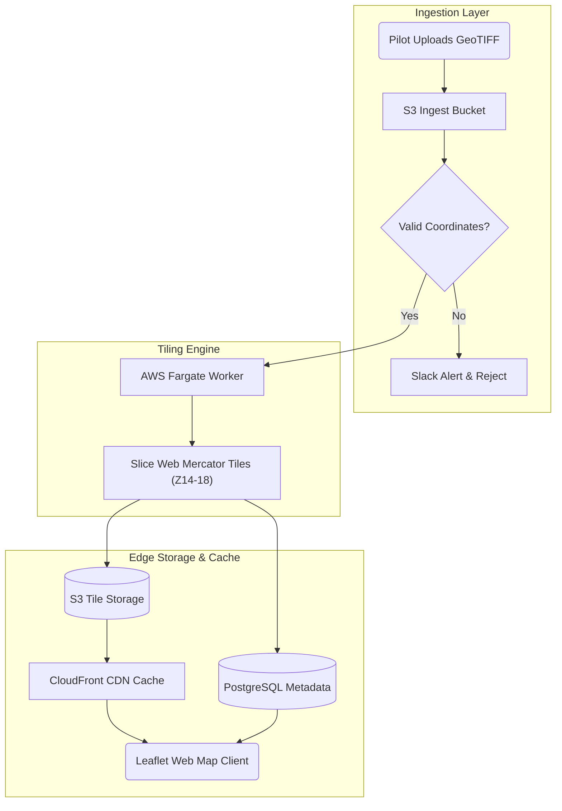

# DxSkills Transformation Gallery: Before & After

> **Visual Proof:** Concrete demonstrations of how DxSkills transforms raw, non-linear ideation into structured, publication-grade cognitive artifacts.
> **Constraint:** Zero em dashes (Unicode U+2014) across all examples.

---

## 📑 Gallery Directory

1. [`dx-dump`: Chaotic Voice Dump to Executive Architecture](#1-dx-dump-chaotic-voice-dump-to-executive-architecture)
2. [`dx-write`: Phonetic Dictation to Authentic Collegial Email](#2-dx-write-phonetic-dictation-to-authentic-collegial-email)
3. [`dx-read`: Bureaucratic Policy Wall to Decision Matrix](#3-dx-read-bureaucratic-policy-wall-to-decision-matrix)
4. [`dx-interview`: 4-Phase Multi-Turn Dialogue to Grant Proposal](#4-dx-interview-4-phase-multi-turn-dialogue-to-grant-proposal)
5. [`dx-map`: Tangled Processing Logic to Syntax-Safe Mermaid Topology](#5-dx-map-tangled-processing-logic-to-syntax-safe-mermaid-topology)

---

## 1. `dx-dump`: Chaotic Voice Dump to Executive Architecture

### Context
A product lead records a messy 90-second voice memo while walking between meetings following a staging incident.

### Raw Input (Unedited Mobile Dictation)
```text
ok quick braindump on the search indexing service so basically we hit a wall yesterday during load test when records passed 10k items per second elastic search cluster started dropping packets and latency spiked to 4500ms which is totally unacceptable for the mobile app launch next month. dev team wants to add 4 more nodes but ops says budget is frozen until q3. dave suggested we add a redis write buffer in front of the ingestion pipeline to smooth the peaks and batch writes every 500ms. we need to test this on staging by wednesday noon so we can present results to maria on thursday morning. also please make sure sarah checks the retry queue logic so dropped events dont get lost forever.
```

### Compiled Output (`dx-dump`)
> **BLUF:** Mitigate search indexing latency spikes by placing a Redis write buffer in front of Elasticsearch, batching writes at 500ms intervals on staging by Wednesday noon to prepare for Thursday review.
>
> ### 1. Key Operational Decisions
> - **Ingestion Buffering:** Deploy Redis buffer to smooth traffic spikes above 10k items/sec without provisioning costly new Elasticsearch nodes.
> - **Batching Cadence:** Configure write flushes at 500ms intervals to eliminate packet drops.
> - **Durability Guarantee:** Audit the Dead Letter Queue (DLQ) retry logic to prevent event loss.
>
> ### 2. Execution Milestone Schedule
> | Milestone | Target Date | Responsible Owner | Verification Criteria |
> | :--- | :--- | :--- | :--- |
> | **Redis Buffer Staging Deploy** | Wednesday 12:00 PM | Platform Dev Team | Ingestion latency stays under 150ms at 15k req/sec |
> | **DLQ Retry Verification** | Wednesday 3:00 PM | Sarah (QA Lead) | 100% replay reliability on simulated drops |
> | **Executive Architecture Review** | Thursday 10:00 AM | Product Lead & Maria | Budget-neutral approval for Q3 rollout |
>
> ### 3. Action Items
> 1. Configure Redis write buffer instance on staging cluster.
> 2. Benchmark 500ms batch flush under peak load simulator.
> 3. Verify retry queue durability and alert thresholds before Thursday morning briefing.

---

## 2. `dx-write`: Phonetic Dictation to Authentic Collegial Email

### Context
A GIS researcher uses speech-to-text to dictate an update to colleagues. The dictation software garbles domain terminology and drops punctuation.

### Raw Input (Phonetic Speech-to-Text)
```text
hey team wanted to give quick update on the regional housing atlas so i finished the coral pleth maps for the southern district yesterday and the light are elevation rasters are finally aligned with the state datum. there was a slight issue with the special join on parcel boundaries because of dirty vertexes but i cleaned up the top ology this morning. draft maps are ready on drive please take a look before our friday sync and let me no if the legend color ramp looks readable for colorblind viewers talk soon
```

### Polished Output (`dx-write`)
```text
Hi team,

I wanted to share a quick update on the regional housing atlas.

The choropleth maps for the southern district are finished, and the LiDAR elevation rasters are aligned with the state datum. We had a small snag with the spatial join on parcel boundaries due to misaligned vertices, but I resolved the topology issues this morning.

The draft maps are ready for you on Google Drive. Please take a look before our Friday sync and let me know if the color ramps work well for colorblind accessibility.

Talk soon,
[Your Name]
```

*Note on Silent Polish:*
- Silently normalized `coral pleth` to `choropleth`.
- Silently normalized `light are` to `LiDAR`.
- Silently normalized `special join` to `spatial join`.
- Silently normalized `top ology` to `topology`.
- Preserved authentic, collegial tone with clean 1-2 sentence scannable paragraphs.
- Zero corporate fluff, zero patronizing correction summaries, and zero em dashes.

---

## 3. `dx-read`: Bureaucratic Policy Wall to Decision Matrix

### Context
A university department receives a dense 5-paragraph administrative memo regarding new institutional research data compliance rules.

### Raw Input (Bureaucratic Wall-of-Text)
```text
In accordance with recent revisions promulgated by the Institutional Data Governance Committee (IDGC) under Policy Directive 2026-B, all principal investigators, research faculty, and technical project personnel operating active research computing repositories containing external grant artifacts must immediately initiate an exhaustive data categorization audit. Commencing October 1, 2026, any project maintaining Tier 3 restricted data assets, including but not limited to unanonymized spatial survey coordinates, identifiable interview recordings, or proprietary third-party commercial feeds, will no longer be permitted to utilize standard shared cloud storage shares without secondary cryptographic boundary verification. Failure to submit Form 409-C along with an attached cryptographic boundary verification manifest by November 15, 2026, will result in automated revocation of external compute cluster network ingress privileges and potential suspension of grant account expenditure disbursement. Project leads desiring an exemption or provisional extension must file an appeal with the Associate Vice Chancellor for Research no later than October 20, 2026, accompanied by an explicit data mitigation plan.
```

### Distilled Output (`dx-read`)
> **BLUF:** Researchers with Tier 3 restricted data (identifiable surveys, spatial coordinates, proprietary feeds) must file Form 409-C with cryptographic proof by November 15, 2026, or risk compute cluster suspension and grant funding freezes.
>
> ### 1. Key Policy Rules
> - **Cloud Storage Ban:** Standard shared cloud drives are prohibited for Tier 3 assets starting October 1, 2026, unless secondary cryptographic encryption is verified.
> - **High-Stakes Penalty:** Non-compliance results in automatic external compute lockout and frozen expenditure accounts.
> - **Tight Exemption Window:** Exemption requests must be filed with the Associate Vice Chancellor by October 20, 2026.
>
> ### 2. Compliance Decision Matrix
> | Data Asset Classification | Required Action | Mandatory Deadline | Penalty for Inaction |
> | :--- | :--- | :--- | :--- |
> | **Tier 1 & 2 (Public / De-identified)** | Standard project storage; no additional filing needed | Ongoing | None |
> | **Tier 3 (Restricted / Spatial / Audio)** | Implement cryptographic boundary; submit Form 409-C | November 15, 2026 | Ingress revoked; grant expenditures frozen |
> | **Provisional Exemption Request** | Submit appeal and data mitigation plan to Assoc. VC | October 20, 2026 | Immediate forfeiture of exemption eligibility |
>
> ### 3. Immediate Milestone Deadlines
> - **October 1, 2026:** Standard shared cloud storage prohibited for Tier 3 assets.
> - **October 20, 2026:** Deadline to file provisional extension appeal.
> - **November 15, 2026:** Hard deadline to submit Form 409-C and verification manifest.

---

## 4. `dx-interview`: 4-Phase Multi-Turn Dialogue to Grant Proposal

### Context
A non-linear researcher wants to draft an NSF educational technology proposal but feels paralyzed by blank-page syndrome. The assistant uses the strict 4-phase state machine.

### Turn 1
**User:** `"/dx ask I want to draft a proposal for an AI spatial learning assistant for neurodivergent STEM students."`

**AI (Phase 1):**
```text
[Phase 1/3 - Target Audience & Stakes]
Who is the primary review panel or grant program evaluating this proposal, and what is their single highest evaluation priority (e.g., intellectual merit, broader societal impact, or technical feasibility)?
```

**User:** `"The NSF Improving Undergraduate STEM Education (IUSE) panel. They care heavily about evidence-based interventions that measurably improve retention in introductory computer science."`

---

### Turn 2
**AI (Phase 2):**
```text
[Phase 2/3 - Core Thesis & Primary Bottleneck]
Understood. We will center the proposal on evidence-based retention for introductory CS cohorts in the NSF IUSE program.

What specific cognitive bottleneck do neurodivergent students face in existing introductory courses that your spatial assistant directly solves?
```

**User:** `"Traditional IDEs force linear, text-heavy code navigation. Spatial and dyslexic learners experience cognitive overload trying to hold complex control flows in working memory without visual structural maps."`

---

### Turn 3
**AI (Phase 3):**
```text
[Phase 3/3 - Tangible Proof & Impact Metrics]
Clear bottleneck: serial code navigation and working memory overload in linear IDEs.

What specific metrics and pilot cohort size will demonstrate success during the initial 12-month study?
```

**User:** `"A 120-student quasi-experimental cohort across two semesters. We want to demonstrate a 15% increase in retention and a 30% reduction in debugging task completion time."`

---

### Turn 4: Final Synthesis
**AI (Phase 4):**
> **BLUF:** A 12-month NSF IUSE proposal requesting funding to deploy a spatial code navigation assistant for 120 introductory computer science students, targeting a 15% increase in retention and a 30% reduction in debugging completion time.
>
> ### Project Prospectus: Spatial Cognitive Scaffolding for Diverse STEM Learners
>
> #### 1. Target Audience & Funding Alignment
> - **Program:** NSF Improving Undergraduate STEM Education (IUSE: EHR).
> - **Core Priority:** Measurable retention improvements and cognitive equity in foundational computing pathways.
>
> #### 2. Problem Statement & Educational Friction
> Traditional programming environments rely on linear, unbroken text editors that overwhelm spatial and non-linear thinkers. Dyslexic students spend disproportionate cognitive bandwidth parsing syntax errors rather than conceptualizing algorithms.
>
> #### 3. Proposed Intervention
> The platform introduces real-time visual code topologies, automated Mermaid flow abstractions, and working-memory shields that project code structures into interactive spatial graphs.
>
> #### 4. Evaluation Framework & Milestones
> | Milestone | Target Date | Cohort Scope | Target Metric |
> | :--- | :--- | :--- | :--- |
> | **Phase 1: Tool Calibration** | Month 1 to 3 | 20 Student Usability Panel | System Usability Scale > 85 |
> | **Phase 2: Fall Pilot** | Month 4 to 8 | 60 Students (CS1 Cohort) | 15% improvement in course completion |
> | **Phase 3: Spring Validation** | Month 9 to 12 | 60 Students (CS2 Cohort) | 30% reduction in debugging cycle times |

---

## 5. `dx-map`: Tangled Processing Logic to Syntax-Safe Mermaid Topology

### Context
A developer verbally explains how aerial drone imagery gets ingested, tiled, and served to an interactive web map.

### Raw Input
```text
when the drone pilot uploads a raw geo tiff to our presigned s3 url an s3 event triggers a lambda function that checks if the file has valid coordinate tags if not it sends an alert to slack and halts if valid it kicks off a fargate container that slices the image into web mercator tiles at zoom levels 14 through 18 saves the tiles back to s3 and invalidates the cloudfront edge cache then writes metadata to our postgres database so the front end map viewer can render the new layer
```

### Rendered Output (`dx-map`)


> ### Pipeline Component Matrix
> | Pipeline Stage | Responsible Service | Function | Output Artifact |
> | :--- | :--- | :--- | :--- |
> | **1. Upload** | Amazon S3 | Ingest raw GeoTIFF payload via presigned URL | Staged GeoTIFF object |
> | **2. Validation** | AWS Lambda | Verify coordinate reference system (CRS) | Validation pass or Slack alert |
> | **3. Slicing** | AWS Fargate | Tile imagery across Zoom 14 through 18 | Web Mercator PNG tiles |
> | **4. Registry** | PostgreSQL | Register layer extent and bounding box | Layer database record |
> | **5. Edge Delivery** | CloudFront & S3 | Cache and deliver map tiles globally | Public HTTPS Tile Stream |
