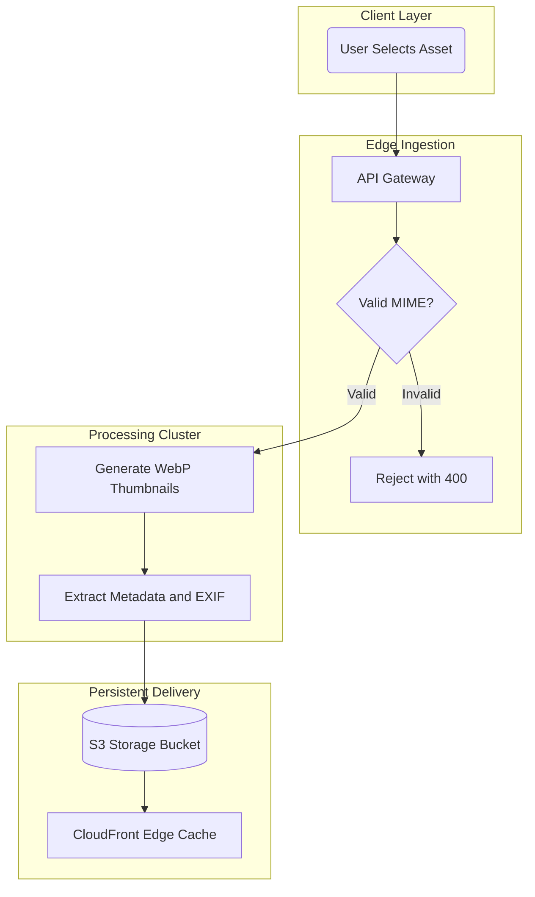

# `dx-map`: Spatial Concept Mapper

Non-linear and dyslexic thinkers often reason spatially, understanding systems as topologies and interconnected networks rather than serial text. The `dx-map` skill transforms prose, outlines, and workflows into clear visual diagrams using Mermaid.js and structured matrices.

---

## ⚡ Core Operational Heuristics & Mermaid Guardrails

To prevent syntax errors and visual clutter, `dx-map` enforces strict syntactical and complexity constraints:

1. **Strict Node Quoting:**
   - Always wrap node text in double quotes inside brackets: `id["Node Label"]`.
   - Never leave unquoted text containing parentheses, hyphens, colons, or punctuation.
   - Example: write `api["API Gateway (Port 8080)"]`, NOT `api[API Gateway (Port 8080)]`.

2. **Complexity & Chunking Quotas:**
   - **Node Limit:** Cap individual diagrams at 8 to 12 nodes.
   - **Depth Limit:** Maximum subgraph hierarchy depth of 3 levels.
   - **Visual Chunking Rule:** If a system exceeds 10 nodes, generate a high-level executive map first, followed by isolated subsystem diagrams. Never produce monolithic spaghetti diagrams.

3. **Standard Orientations & Shapes:**
   - Default to `graph TD` (Top-Down) for procedural, chronological, or decision workflows.
   - Default to `graph LR` (Left-to-Right) for streaming data pipelines, event buses, and ETL.
   - Stick to 4 standard node shapes:
     - Rectangles: `id["Step or Service"]`
     - Rounded pills: `id("User Action / Trigger")`
     - Decisions: `id{"Validation Check?"}`
     - Databases: `id[("Storage Bucket / DB")]`

4. **Label Length Constraint:**
   - Keep node labels under 6 words per node.
   - Do not embed raw HTML ` ` tags or complex styling classes that cause parser failures in native Markdown viewers.

5. **Mandatory Companion Component Matrix:**
   - Every Mermaid diagram must be immediately accompanied by a structured Markdown table detailing the components, responsibilities, inputs, and outputs.

---

## 🏛️ Spatial Metaphors & Archetypes

1. **Visual Spatial Storyboarding (Gavin Newsom Archetype):**
   - Use `/dx storyboard` to convert complex presentations, policies, or unscripted speeches into architectural memory rooms and sequential visual anchors.
   - Organizes ideas into 4 thematic blocks: Blue Context, Amber Friction, Emerald Strategy, and Violet Action.

2. **Visual Mnemonic Taxonomy & Assembly Schemas (Ingvar Kamprad Archetype):**
   - Use `/dx taxonomy` to convert abstract codes, APIs, and procedural instructions into intuitive physical categories and wordless step-by-step assembly flows.

3. **Whole-System Spatial Metaphors (Steve Jobs Principle):**
   - Map software and organizational systems not as isolated code blocks, but as physical architecture (front gate, workshop, vault, terrace).

---

## 📋 Trigger & Usage

### Manual Triggers
- `/dx map <process, concept, or document>`: General spatial flowchart and component matrix.
- `/dx storyboard <speech, policy, or presentation notes>`: Four-room spatial memory storyboard.
- `/dx taxonomy <technical terms, code list, or manual>`: Mnemonic physical categorization.

### Example Flow
**User:** `"/dx map How does an image upload pipeline process, resize, and store assets to S3 and CDN?"`

**AI Output:**

> ### Pipeline Component Matrix
> | Stage | Component | Primary Function | Output Artifact |
> | :--- | :--- | :--- | :--- |
> | **1. Ingest** | API Gateway | Inspect payload and validate MIME type | Sanitized byte stream |
> | **2. Process** | Worker Cluster | Resize to standard breakpoints (sm, md, lg) | WebP image assets |
> | **3. Store** | AWS S3 | Long-term asset storage | S3 URI |
> | **4. Serve** | CloudFront | Global edge CDN caching | Public HTTPS URL |
