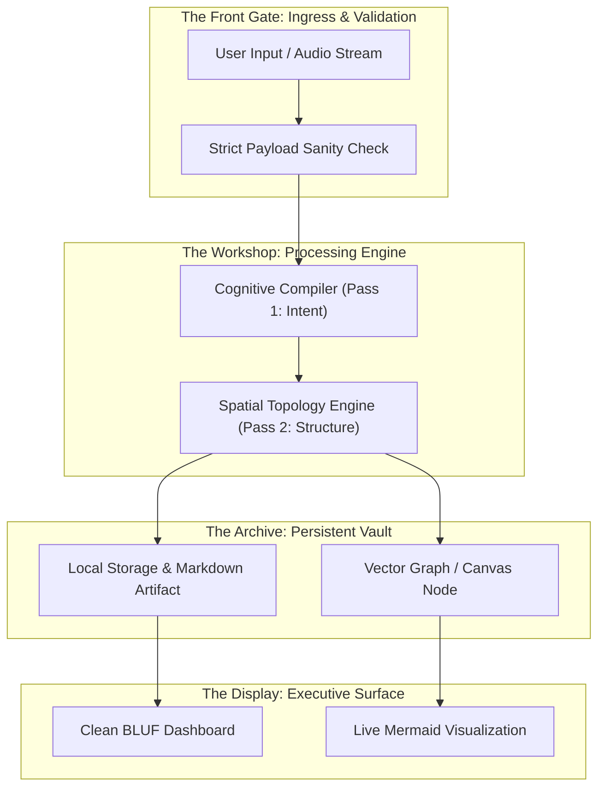

# Executive Markdown Specification & Whole-System Architecture

> **Cognitive Archetype:** Steve Jobs (Whole-System Spatial Metaphors & Direct Technical Clarity)  
> **Command:** `/dx spec <disordered engineering notes, whiteboard dump, or feature list>`  
> **Objective:** Stop stalling in 40-page specification documents and endless email threads. Compile disordered engineering fragments into an Executable Mermaid Architecture, Technical Tradeoff Matrix, and Distilled Action Plan.

---

## 🏛️ Whole-System Spatial Metaphor

Treat software not as serial text files, but as a living physical architecture:

---

## ⚖️ Technical Tradeoff & Decision Matrix

| Architectural Dilemma | Chosen Direction | Rejected Alternative | Decisive Rationale |
| :--- | :--- | :--- | :--- |
| **State Persistence** | Pure Client-Side Local State | Heavy Cloud Database | Zero login friction; instant launch; complete user privacy. |
| **Diagram Engine** | Browser-Native Mermaid.js | Heavy Canvas WebGL Dependency | Lightweight bundle, plain-text exportable, renders everywhere. |
| **API Architecture** | Model Context Protocol (MCP) | Custom REST API Endpoints | Universal native compatibility across Claude, Cursor, and Antigravity. |
| **Text Output** | Direct Grounded Markdown | Long Prose with Commentary | Eliminates reading drag and cognitive fatigue. |

---

## ⚡ Executive Specification Breakdown

### 1. User Experience Guarantee
- **First Reaction:** Instant comprehension in under 5 seconds.
- **Cognitive Load:** Zero formatting tax on input. Accept messy shorthand without complaint.
- **Latency Budget:** Sub-50ms local compilation for text and diagrams.

### 2. Core Technical Constraints
- **Zero External Server Dependency:** All essential cognitive compilation runs locally or in-browser.
- **Zero AI Fluff:** No synthetic filler, no conversational preambles, no em dashes.
- **Deterministic Output:** Structured sections (BLUF, System Map, Decisions, Next Steps).

### 3. Concrete Action Sequence
1. [ ] Wire up input stream directly to intent parser.
2. [ ] Render visual Mermaid state graph before generating prose.
3. [ ] Run automated lint gate to enforce zero em dashes.
4. [ ] Export single self-contained deliverable.
