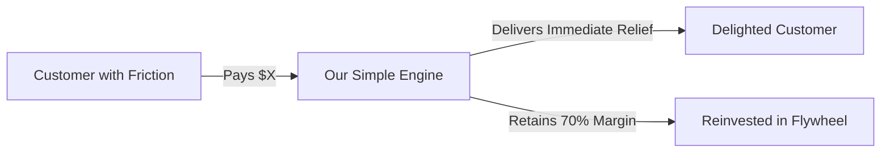

# The Back-of-a-Beer-Mat / Napkin Test Template

> **Cognitive Archetype:** Richard Branson (Radical Simplification & Core Value Exchange)  
> **Command:** `/dx napkin <business pitch, idea dump, or proposal>`  
> **Objective:** If an idea cannot fit on the back of a beer mat, it is probably not going to work. Strip away 60-page PDF decks and buzzword padding to reveal the core value exchange and the 3 essential levers.

---

## 🍺 The Beer-Mat Canvas (Single-Card Format)

```text
+-------------------------------------------------------------+
|                     THE BEER MAT TEST                       |
|                                                             |
| 1. CORE VALUE EXCHANGE:                                     |
|    [Who pays whom, for what immediate transformation?]      |
|                                                             |
| 2. THE THREE LEVERS:                                        |
|    - Lever 1: [Acquisition / Customer Trigger]             |
|    - Lever 2: [Delivery / Engine Advantage]                |
|    - Lever 3: [Unit Economics / Margin Retention]          |
|                                                             |
| 3. BACK-OF-THE-ENVELOPE MATH:                               |
|    Cost to produce:     $ [X]                               |
|    Price to customer:   $ [Y]                               |
|    Gross margin:        $ [Y - X] ([Z]%)                    |
|    Breakeven volume:    [N] units per month                 |
|                                                             |
| 4. THE ACID TEST:                                           |
|    Can a 10-year-old explain this business to their friend? |
+-------------------------------------------------------------+
```

---

## 🔄 Core Value Exchange Flow



---

## ⚡ Radical Simplification Matrix

| Element | Complicated Corporate Pitch | The Beer-Mat Truth |
| :--- | :--- | :--- |
| **Value Proposition** | Multi-sided synergy enablement ecosystem | We save regional airlines 4 hours per turnaround. |
| **Go-to-Market** | Omnichannel outbound programmatic pipeline | We call 20 fleet managers who already know the problem. |
| **Moat** | Proprietary multi-modal algorithmic flywheel | We are twice as fast and half the overhead. |
| **Risk** | Macro-economic regulatory deceleration | We need 15 paying customers to break even. |

---

## 📋 Operating Rules for the Napkin Test
1. **Zero jargon tolerance:** If a word like "synergy", "paradigm", or "leverage" appears without physical meaning, delete it.
2. **Numbers must be arithmetic:** Addition, subtraction, multiplication only. No speculative 5-year DCF projections.
3. **Strictly zero em dashes:** Keep prose punchy and grounded.
