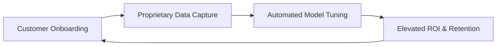

# Cognitive Dump Template: Startup Venture Pitch Architecture
# Used by: dx-dump (/dx dump pitch)

## Operational Objective
Converts raw founder vision brainstorms, technical specs, and scattered voice dictations into a crisp, linear 10-slide investor pitch narrative.

---

## Standard Compilation Output

```markdown
# Venture Pitch Narrative: [Company / Project Name]

> **One-Line Thesis:** [1 concise sentence capturing who you serve, what you do, and why you win]
> **Target Raise:** [$ Amount] | **Stage:** [Pre-Seed / Seed / Series A]

---

## 1. The 10-Slide Deck Blueprint

| Slide | Theme | Core Message & Narrative Anchor | Key Visual / Data Point |
| :--- | :--- | :--- | :--- |
| **01. Problem** | Acute Pain Point | [Specific, painful workflow bottleneck experienced by customers] | Cost of status quo ($ or hours lost) |
| **02. Solution** | Novel Mechanism | [How your software / model eliminates this bottleneck entirely] | Before vs. After contrast |
| **03. Market** | Scale & Timing | [Why this market is massive and why right now is the tipping point] | Bottom-up TAM / SAM / SOM calculation |
| **04. Product** | Unfair Ergonomics | [Walkthrough of the actual user experience and spatial flow] | 3-step pipeline screenshot or diagram |
| **05. Business Model** | Unit Economics | [How you charge, margins, expansion loops, and ACV] | Pricing tiers and payback timeline |
| **06. Traction** | Proof & Momentum | [Early evidence that customers demand this product] | MoM revenue, waitlist count, or pilot LOIs |
| **07. Competition** | Differentiation | [Why legacy alternatives fail to solve this problem] | 2x2 quadrant or feature matrix |
| **08. Moat** | Defensibility | [Network effects, proprietary datasets, or switching costs] | Retention cohorts or flywheels |
| **09. Team** | Founder-Market Fit | [Why this specific team has an unfair advantage in execution] | Past exits, domain PhDs, or patents |
| **10. The Ask** | Capital Deployment | [How much capital you are raising and exact 18-month milestones] | Use-of-funds breakdown |

---

## 2. The Core Flywheel Diagram


---

## 3. Immediate 18-Month Milestones
- **Month 6:** Production GA release and first 25 paying enterprise pilots.
- **Month 12:** Break-even unit economics and $1M ARR run-rate.
- **Month 18:** Series A readiness and platform ecosystem expansion.
```
