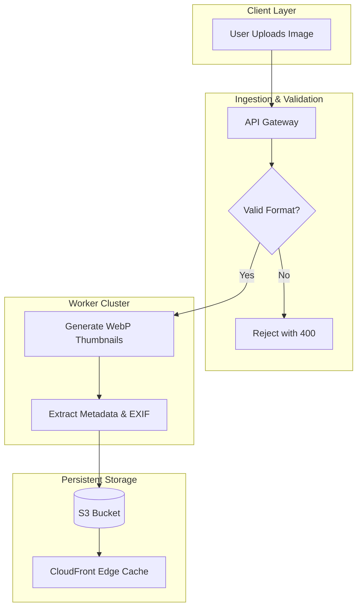

# `dx-map`: Spatial Concept Mapper

Non-linear and dyslexic thinkers often reason spatially, understanding systems as topologies and interconnected networks rather than serial text. The `dx-map` skill transforms prose, outlines, and workflows into clear visual diagrams using Mermaid.js and structured matrices.

---

## ⚡ Core Operational Heuristics

1. **Topology Before Narrative:**
   - When explaining an interconnected concept, begin with a diagram or structured matrix before presenting detailed explanations.
   - Use flowcharts (`graph TD` or `graph LR`), state diagrams, or quadrant charts to visualize system logic.

2. **Mermaid Syntax Discipline:**
   - Always quote node labels containing special characters, hyphens, or parentheses to prevent rendering errors (e.g., `id["Node Title (Details)"]`).
   - Keep node labels concise (under 6 words per node).
   - Use visual subgraphs to group related domains or microservices.

3. **Complementary Spatial Matrix:**
   - Accompany diagrams with a clean Markdown matrix summarizing states, inputs, outputs, and responsible components.

---

## 📋 Trigger & Usage

### Manual Trigger
- `/dx map <process, concept, or document>`
- `"Map this system spatially: <description>"`

### Example Flow
**User:** `"/dx map How does an image upload pipeline process, resize, and store assets to S3 and CDN?"`

**AI Output:**

> ### Pipeline Component Matrix
> | Stage | Component | Primary Function | Output Artifact |
> | :--- | :--- | :--- | :--- |
> | **1. Ingest** | API Gateway | Inspect payload and validate MIME type | Sanitized byte stream |
> | **2. Process** | Worker Node | Resize to standard breakpoints (sm, md, lg) | WebP image assets |
> | **3. Store** | AWS S3 | Long-term asset storage | S3 URI |
> | **4. Serve** | CloudFront | Global edge CDN caching | Public HTTPS URL |
