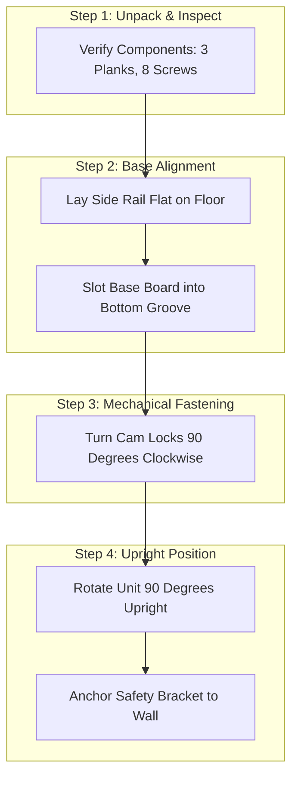

# Visual Mnemonic Taxonomy & Pictorial Procedural Schema Template

> **Cognitive Archetype:** Ingvar Kamprad (Visual Mnemonic Taxonomy & Wordless Assembly)  
> **Command:** `/dx taxonomy <technical spec, code list, or assembly procedure>`  
> **Objective:** Convert abstract numerical item codes, dense technical acronyms, and convoluted text instructions into memorable spatial taxonomies and wordless procedural flows.

---

## 🧭 The Kamprad Mnemonic Principle

Abstract serial numbers (e.g., `SKU-84920-X` or `HTTP 502 error handler`) overburden the phonological loop. Replace them with intuitive, tangible physical categories:

| Abstract Code / Feature | Mnemonic Category | Physical Analogy | Cognitive Anchor |
| :--- | :--- | :--- | :--- |
| **API Gateway Routing** | River Delta | Water distributing to branches | Fast routing, split flows |
| **In-Memory Cache (Redis)** | The Workbench | Tools laid out right in front | Zero-reach instant retrieval |
| **Database Storage (Postgres)** | The Archive Vault | Heavy stone walls with locks | Permanent durability |
| **Edge CDN Delivery** | Local Outposts | Stashes placed across terrain | Low latency, nearby stock |

---

## 📐 Pictorial Assembly Schema (Step-by-Step Flow)

Transform linear procedural manuals into clear node diagrams and spatial step cards:

---

## 📦 Spatial Volume & Geometric Matrix

| Step | Component | Spatial Action | Verification Rule |
| :--- | :--- | :--- | :--- |
| **01** | Base & Rail | Align grooved edges inward. | Both grooves form continuous track. |
| **02** | Shelves | Insert wooden dowels by hand. | Zero tools needed; flush with face. |
| **03** | Fasteners | Tighten locking screws. | Rotate 1/4 turn until firm stop. |
| **04** | Anchoring | Fix bracket directly into wall stud. | Unit cannot tilt forward under load. |

---

## 📋 Operating Rules for Mnemonic Taxonomy
1. **Replace abstract labels with physical anchors:** Use geography, nature, tools, or architectural elements.
2. **Wordless clarity:** Instructions must be understandable purely from arrows, nodes, and spatial orientation.
3. **Strictly zero em dashes:** Direct, declarative sentences.
