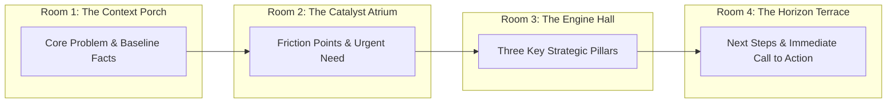

# Visual Spatial Storyboard & Architectural Memory Template

> **Cognitive Archetype:** Gavin Newsom (Unscripted Speech & Relational Briefings)  
> **Command:** `/dx storyboard <notes, speech topic, or policy brief>`  
> **Objective:** Replace teleprompters and verbatim speech scripts with color-coded thematic blocks, visual spatial memory rooms, and relational Mermaid diagrams.

---

## 🏛️ Spatial Memory Architecture (The Four Rooms)

For non-linear thinkers, memorizing paragraphs of text is inefficient and leads to phonological fatigue. Instead, anchor the presentation into a spatial journey of four distinct conceptual rooms:

---

## 🎨 Color-Coded Thematic Blocks

Organize briefing notes into scannable thematic cards rather than linear paragraphs:

### 🔵 Blue Block: Problem & Baseline
- **The Core Tension:** [1 sentence defining why we are here]
- **Key Ground Truths:** [2-3 indisputable facts or numbers]
- **Spatial Anchor:** Visualize the current system baseline.

### 🟡 Amber Block: The Critical Pivot
- **The Friction Point:** [What broke or why the status quo failed]
- **The Stakeholder Cost:** [Who is affected and the daily consequence]
- **Spatial Anchor:** Visualize the point of divergence.

### 🟢 Emerald Block: The Strategic Solution
- **Pillar 1:** [First concrete action]
- **Pillar 2:** [Second concrete action]
- **Pillar 3:** [Third concrete action]
- **Spatial Anchor:** Visualize the three pillars supporting the bridge.

### 🟣 Violet Block: The Horizon Call to Action
- **The Immediate Next Move:** [What must happen in the next 48 hours]
- **The Uncompromising Standard:** [The quality bar or final outcome]
- **Spatial Anchor:** Visualize the finish line.

---

## 🎙️ Executive Speaking Cards (Zero Teleprompter)

| Sequence | Visual Cue | Key Speaking Anchor | Timing |
| :--- | :--- | :--- | :--- |
| **01. Opening** | The Context Porch | Lead with BLUF: State the outcome first. | 2 min |
| **02. Tension** | The Catalyst Atrium | Contrast the old limitation with the real opportunity. | 3 min |
| **03. Deep Dive** | The Engine Hall | Walk through the 3 pillars using hand gestures for spatial grouping. | 8 min |
| **04. Close** | The Horizon Terrace | Close with direct accountability and the next immediate milestone. | 2 min |

---

## 📋 Operating Rules for Visual Storyboarding
1. **Never read verbatim text:** Look at the visual card, absorb the anchor, and speak conversationally.
2. **One idea per card:** If a card has more than 3 bullet points, split it into a new room.
3. **Strictly zero em dashes:** Maintain clean, punchy sentence boundaries.
