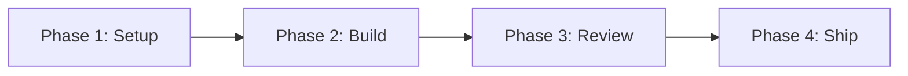

# Project Breakdown Plan Template

> **Command:** `/dx plan <project goal>` with horizon set to project
> **Objective:** Break a large, intimidating project into phased milestones and a dependency-ordered checklist, so a multi-week effort becomes a sequence of single obvious moves.

---

## 🎯 BLUF
> **Project outcome:** [What "done" looks like in one sentence.]
> **Target date:** [Deadline or milestone date.]
> **Critical path:** [The 1-2 steps that everything else waits on.]

---

## 🗺️ Phase Map

---

## ▶️ Start Here (2-minute version)
[The smallest possible first action inside Phase 1.]

---

## ✅ Milestone Checklist

| Phase | Milestone | Depends On | Focus Blocks | Done |
| :--- | :--- | :--- | :--- | :--- |
| 1 | [Setup milestone] | none | 2 x 25 min | [ ] |
| 2 | [Build milestone] | Phase 1 | 4 x 45 min | [ ] |
| 3 | [Review milestone] | Phase 2 | 2 x 25 min | [ ] |
| 4 | [Ship milestone] | Phase 3 | 1 x 15 min | [ ] |

---

## 🚧 Blocker Radar
1. [Anything waiting on another person, ordered so you request it early.]
2. [Any resource, access, or approval you need before a later phase.]

---

## 🧠 Executive Function Guardrails
1. Only the current phase is active. Later phases stay collapsed on the page.
2. Every milestone names its dependency, so you never start a blocked step.
3. Re-run `/dx plan` at the start of each phase to re-sequence with fresh context.
