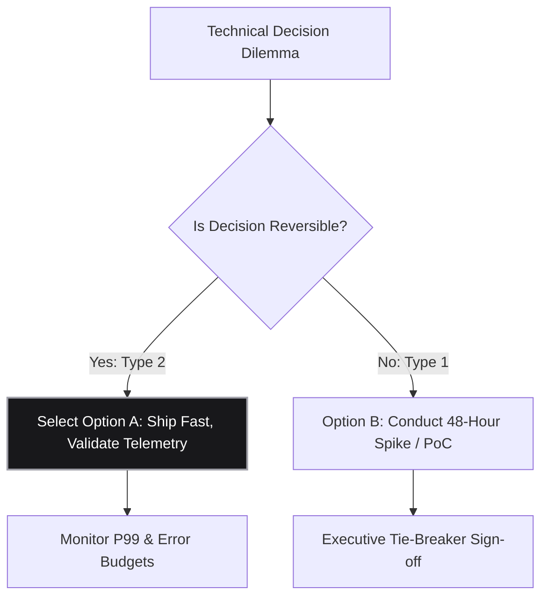

# Architectural Conflict Resolution Template

> **Skill:** `dx-read` (Cognitive Intake & Disagreement De-escalation)  
> **Target:** Long email threads, Slack debates, contradictory RFC comments, and design deadlocks  
> **Output:** Objective comparative trade-off matrix and clear tie-breaker pathway  
> **Strict Rule:** NO em dashes anywhere (use hyphens, commas, colons, or parentheses)

---

## 🎯 When to Use

Use this template whenever a team is stuck in a circular, multi-page debate between competing technical or strategic architectures. It converts subjective ideological arguments into an objective engineering trade-off matrix.

---

## 📋 Standard Architecture

### 1. Conflict Core (BLUF)
- **The Deadlock:** Single sentence defining the root technical tension (e.g. "Option A optimizes for local write latency via in-memory state, while Option B optimizes for global disaster recovery via cross-region replication.").
- **Decision Horizon:** Target sign-off date (e.g. "Must decide by Friday 5:00 PM to hit Q4 launch runway.").

### 2. Multi-Perspective Trade-Off Matrix

| Evaluation Dimension | Option A: [Name] | Option B: [Name] | Winner / Tie-breaker |
| :--- | :--- | :--- | :--- |
| **Development Velocity** | Fast (utilizes existing ORM) | Slower (requires new schema) | **Option A** (+2 weeks saved) |
| **Operational Complexity** | High (manual failover script) | Low (managed cloud automation) | **Option B** (lower on-call burden) |
| **P99 Latency Impact** | < 15ms | ~ 65ms | **Option A** (3.3x faster) |
| **Capital Cost (Monthly)** | $1,200 | $3,800 | **Option A** ($2.6k savings) |
| **Reversibility Factor** | High (Type 2 decision) | Low (Type 1 decision) | **Option A** (easier to rollback) |

### 3. Visual Decision Tree (Mermaid)

### 4. Tie-Breaker Directive
- **Selected Action:** Clear, unambiguous path chosen based on the dimension with highest strategic weight.
- **Immediate 48-Hour Milestone:** One small, testable proof-of-concept deliverable that validates or invalidates the key risk assumption.
