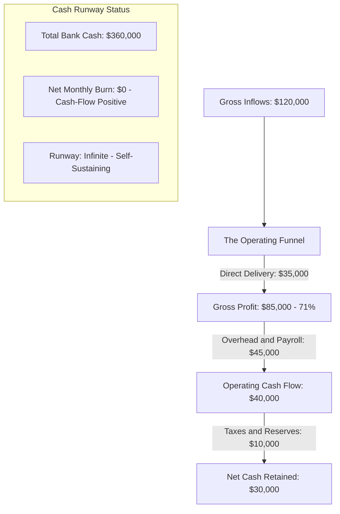

# Financial & Metric Conversational Digest Template

> **Cognitive Archetype:** Richard Branson (Boardroom Financial Scaffolding)  
> **Command:** `/dx finance <spreadsheet dump, balance sheet, or financial report>`  
> **Objective:** Convert rows of confusing financial figures and dense spreadsheets into conversational executive summaries and visual cash-flow diagrams.

---

## 💬 The Conversational Balance Sheet

When reviewing financial numbers, non-linear thinkers lose momentum reading 50-row spreadsheets. This template distills financial health into four plain-English answers:

1. **How much cash came in through the front door?** (Revenue & Gross Inflows)
2. **How much cash walked out the back door?** (Operating Expenses & Cost of Goods)
3. **What is left in the register right now?** (Net Cash & Runway)
4. **Where is the financial leak or opportunity?** (Core Margin Driver)

---

## 📊 Visual Cash-Flow Topology

---

## 📋 Conversational Executive Matrix

| Financial Metric | Raw SpreadSheet Value | Conversational Translation | Status / Health |
| :--- | :--- | :--- | :--- |
| **Gross Revenue** | $120,450.00 | We brought in $120k this month across 4 key contracts. | Healthy (+12% MoM) |
| **Cost of Goods** | $35,120.00 | Delivery costs were $35k, primarily cloud compute and contractors. | Expected (29% of rev) |
| **Overhead** | $45,300.00 | Fixed operational overhead sits steady at $45k. | Controlled |
| **Net Retained** | $30,030.00 | We banked $30k clean profit to reserves. | Strong |
| **Cash Buffer** | $360,000.00 | We have 12 months of total operating expenses in the bank. | Safe |

---

## 🎯 The Three Boardroom Takeaways
- **The Good News:** Gross margins remain robust at 71%, proving pricing power.
- **The Watch Item:** Cloud compute costs ticked up 8% due to increased ingest volume.
- **The Next Move:** Lock in annual committed cloud discounts to save $1,200 per month starting next quarter.

---

## 📋 Operating Rules for Financial Translation
1. **Round the numbers:** Drop pennies and exact cents unless auditing taxes. Think in thousands ($k).
2. **Explain the meaning before the ratio:** Say "We keep 71 cents of every dollar" rather than "Gross margin is 70.83%".
3. **Strictly zero em dashes:** Direct, grounded conversational sentences.
