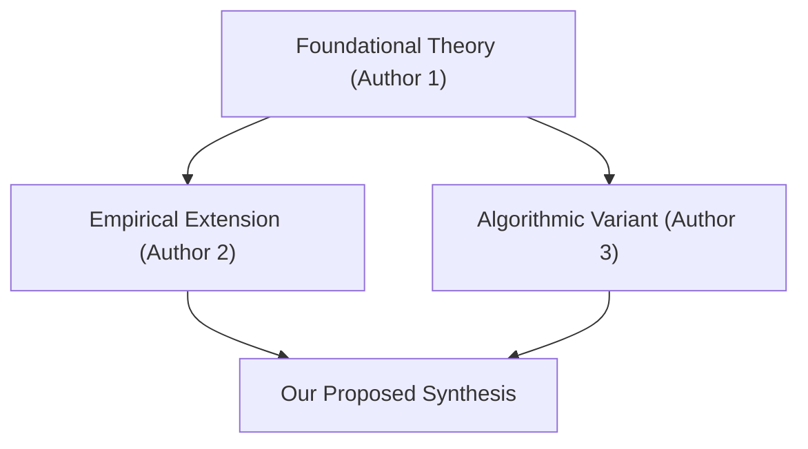

# Cognitive Intake Template: Literature Synthesis Matrix
# Used by: dx-read (/dx read matrix)

## Operational Objective
Extracts and harmonizes findings across 3 to 10 dense scholarly papers into a comparative research matrix, highlighting consensus, contradictions, and methodological trade-offs.

---

## Standard Output Format

```markdown
# Literature Synthesis Matrix: [Research Domain / Topic]

> **BLUF:** Synthesizes [Number] studies on [Topic]. Current consensus validates [Consensus Point], while significant methodological divergence persists regarding [Divergence Point].

---

## 1. Cross-Paper Comparative Matrix

| Paper (Author, Year) | Core Focus | Methodology / Architecture | Primary Dataset | Key Empirical Finding | Open Limitation / Gap |
| :--- | :--- | :--- | :--- | :--- | :--- |
| [Author 1 et al., 2025] | [Problem Statement] | [Deep learning / GIS] | [Global satellite archive] | [Reported metric / improvement] | [High compute footprint] |
| [Author 2 et al., 2024] | [Problem Statement] | [Statistical regression] | [Survey cohort, n=1,200] | [Statistically significant trend] | [Self-reporting bias] |
| [Author 3 et al., 2026] | [Problem Statement] | [Agentic simulation] | [Synthetic urban twin] | [Emergent behavioral pattern] | [Sim-to-real transfer gap] |

---

## 2. Thematic Consensus & Contradictions

### Points of Strong Consensus
- **Point 1:** All evaluated studies confirm that [Shared observation or baseline result].
- **Point 2:** Empirical agreement exists across [Domain or variable].

### Points of Active Scholarly Contradiction
| Contested Question | Position A (Author, Year) | Position B (Author, Year) | Underlying Cause of Divergence |
| :--- | :--- | :--- | :--- |
| [E.g., Scalability of Method] | Argues for localized edge models | Argues for centralized cloud pipelines | Differing assumptions about network bandwidth |
| [E.g., Variable Importance] | Identifies factor X as dominant | Identifies factor Y as dominant | Different sampling temporal resolution |

---

## 3. Conceptual Relationship Map


---

## 4. Synthesis for Your Research
- **Validated Methodological Choices:** [What techniques you can confidently adopt based on literature]
- **Identified Research Void:** [The precise gap your paper / project can fill]
```
